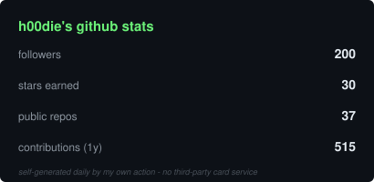
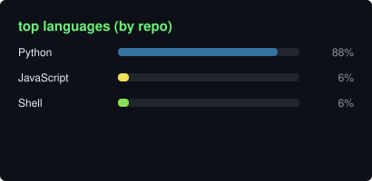

 

---

## :wave: whoami

offensive security researcher. i hunt hostile-input bugs - the kind that pop when a
security tool eats attacker-controlled data - and i run responsible disclosure
campaigns against whoever ships them.

- :mag_right: **tool audits** - i point scanners, frameworks and agents at themselves. recent reports: Tenable, Rapid7, Greenbone
- :boom: **CVE PoCs** - weaponized proof-of-concepts in my spare time (see below)
- :cloud: **cloud red team** - AWS / GCP attack paths, role juggling and privilege-escalation mazes
- :radio: **hardware bench** - Flipper Zero + ESP32 counter-surveillance: hunting Flock/ALPR cameras and rogue BLE trackers
- :snake: **languages** - Python first, Ruby for module dev

---

## :satellite: currently tracked disclosures

> score so far: **2 fixed** (1 with a bounty :trophy:) - **1 partially fixed** - **4 ghosted** :ghost: - **3 refused** - **1 pending public writeup**
>
> one of these is feeding a potential Black Hat Europe talk.

| # | target | contacted | outcome | notes |
| --- | -------- | ----------- | --------- | ------- |
| 1 | REDACTED1 | Jun 12, Jul 2 |  | declined to fix |
| 2 | REDACTED2 | Jul 8, 10, 20 |  | no response |
| 3 | REDACTED3 | Jul 15, Jul 26, Jul 2, Jul 10, Jul 20 |  | no response |
| 4 | REDACTED4 | - |  | part of the potential Black Hat Europe talk |
| 5 | REDACTED5 | Jun 21, 26, Jul 10, 20 |  | no response |
| 6 | REDACTED6 | Jun 20, 25, 27, Jul 3, 13, 20 |  | PoCs delivered, then silence |
| 7 | REDACTED7 | May 6, 15, Jun 15, 21, 26, 30 |  | some vulns fixed |
| 8 | REDACTED8 | Jun 21, Jul 2, 10, 13, 20, 20, 21 |  | vulnerabilities fixed |
| 9 | REDACTED9 | Jul 8 |  | tickets marked resolved, not interested |
| 10 | REDACTED10 | Jun 27, 29, Jul 2, 10 |  | tickets closed as resolved/spam |
| 11 | REDACTED11 | Jul 24 |  | fixed, bounty paid |

### fresh submissions

| vendor | channel | submitted | status |
| -------- | --------- | ----------- | -------- |
| Tenable | HackerOne | Aug 26 |  |
| Rapid7 | support ticket #142316 | Aug 27 |  |
| Greenbone Security | direct email | Aug 29 |  |

---

## :boom: CVE playground

| CVE | PoC |
| ----- | ----- |
| CVE-2026-19626 | [POC-CVE-2026-19626](https://github.com/h00die/POC-CVE-2026-19626) |
| CVE-2026-19679 | [POC-CVE-2026-19679](https://github.com/h00die/POC-CVE-2026-19679) |
| CVE-2026-19681 | [POC-CVE-2026-19681](https://github.com/h00die/POC-CVE-2026-19681) |

more in the oven as disclosures clear.

---

## :bar_chart: the numbers

---

## :handshake: upstream contributions

full list of external repos (not mine) that i've sent PRs to:

*note: metasploit module work usually starts as collaboration in friends' forks of
metasploit-framework before it lands upstream - those collab PRs aren't listed here.
only [rapid7/metasploit-framework](https://github.com/rapid7/metasploit-framework) counts.*

<!-- prs:start -->
**593 PRs** to **25 external repos** (repos i don't own)

| repo | PRs | merged |
| --- | --- | --- |
| [rapid7/metasploit-framework](https://github.com/rapid7/metasploit-framework) | 530 | 487 |
| [RhinoSecurityLabs/pacu](https://github.com/RhinoSecurityLabs/pacu) | 15 | 15 |
| [HackTricks-wiki/hacktricks-cloud](https://github.com/HackTricks-wiki/hacktricks-cloud) | 9 | 8 |
| [ndepthsecurity/EtherJack](https://github.com/ndepthsecurity/EtherJack) | 6 | 5 |
| [jojoeb16/Python_StockResearch](https://github.com/jojoeb16/Python_StockResearch) | 5 | 5 |
| [DefectDojo/django-DefectDojo](https://github.com/DefectDojo/django-DefectDojo) | 3 | 2 |
| [UberGuidoZ/Flipper](https://github.com/UberGuidoZ/Flipper) | 3 | 3 |
| [nmap/nmap](https://github.com/nmap/nmap) | 3 | 0 |
| [Lucaslhm/Flipper-IRDB](https://github.com/Lucaslhm/Flipper-IRDB) | 2 | 2 |
| [rapid7/metasploit-payloads](https://github.com/rapid7/metasploit-payloads) | 2 | 2 |
| [HavocFramework/Havoc](https://github.com/HavocFramework/Havoc) | 1 | 1 |
| [JakeSwiz/WatchFlock](https://github.com/JakeSwiz/WatchFlock) | 1 | 0 |
| [Jonathan-f8/Cyber_Saturday_Website](https://github.com/Jonathan-f8/Cyber_Saturday_Website) | 1 | 0 |
| [ReconGrunt/FlipDeFlock](https://github.com/ReconGrunt/FlipDeFlock) | 1 | 1 |
| [RogueMaster/flipperzero-firmware-wPlugins](https://github.com/RogueMaster/flipperzero-firmware-wPlugins) | 1 | 0 |
| [UberGuidoZ/Flipper-IRDB](https://github.com/UberGuidoZ/Flipper-IRDB) | 1 | 1 |
| [flipperdevices/flipperzero-firmware](https://github.com/flipperdevices/flipperzero-firmware) | 1 | 1 |
| [hotnops/AWSRoleJuggler](https://github.com/hotnops/AWSRoleJuggler) | 1 | 0 |
| [peass-ng/PEASS-ng](https://github.com/peass-ng/PEASS-ng) | 1 | 0 |
| [rapid7/metasploit-credential](https://github.com/rapid7/metasploit-credential) | 1 | 1 |
| [rapid7/rex-exploitation](https://github.com/rapid7/rex-exploitation) | 1 | 0 |
| [redcanaryco/atomic-red-team](https://github.com/redcanaryco/atomic-red-team) | 1 | 1 |
| [snyk/leaky-vessels-dynamic-detector](https://github.com/snyk/leaky-vessels-dynamic-detector) | 1 | 1 |
| [snyk/leaky-vessels-static-detector](https://github.com/snyk/leaky-vessels-static-detector) | 1 | 1 |
| [tenable/poc](https://github.com/tenable/poc) | 1 | 1 |
<!-- prs:end -->

<!-- the list above + the stat cards regenerate daily via .github/workflows/stats.yml - no third-party card service -->

---

<i>no vendors were harmed in the making of this page. they were just politely emailed and called. repeatedly.</i>

